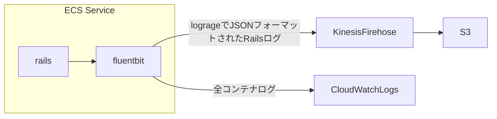

# sample-fluentbit

Fluent Bit で特定ログを抽出するサンプルとして以下構成を想定した作りにしました。

以下構成を前提に Fluent Bit の設定ファイルが正しく動作するかテスト実施しています。

## 構成

- 全コンテナログは CloudWatch Logs へ配信
- lograge で JSON フォーマットされた Rails ログは Kinesis Firehose 経由で S3 に保存され
  - Glue Crawler でクローリングすることで Glue テーブルに定義され、Athena でクエリ捜査できる様になる
